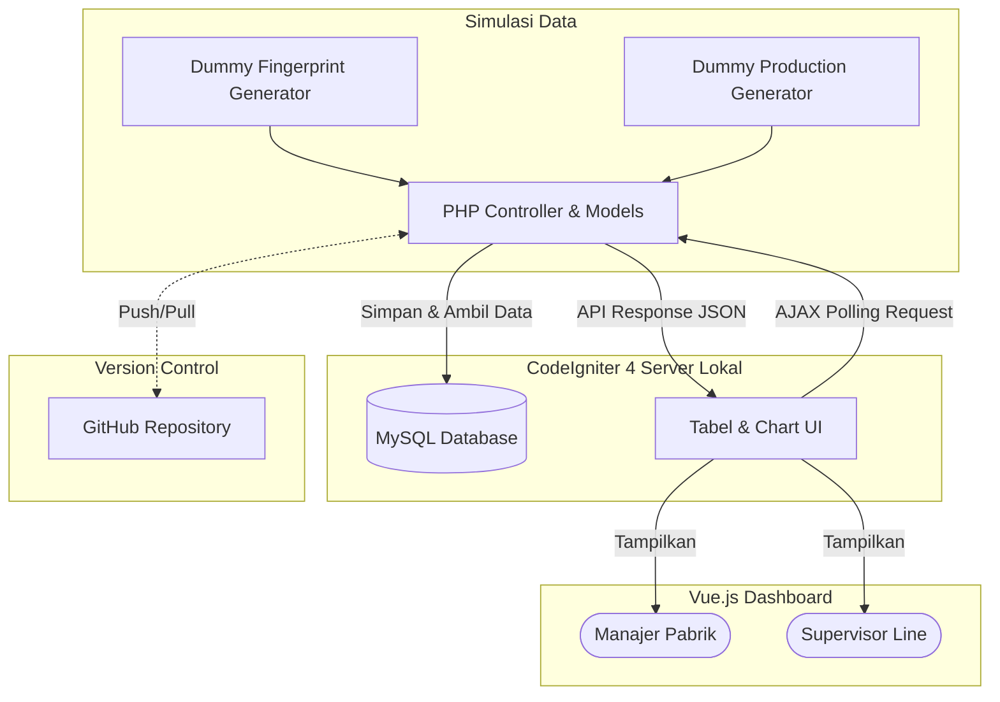
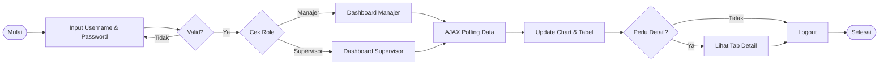
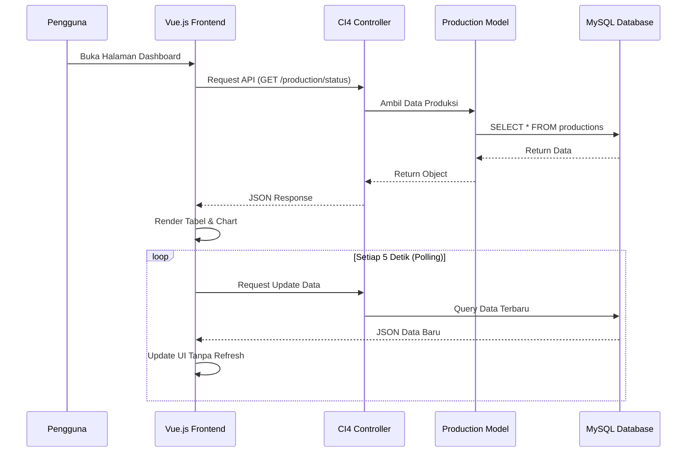
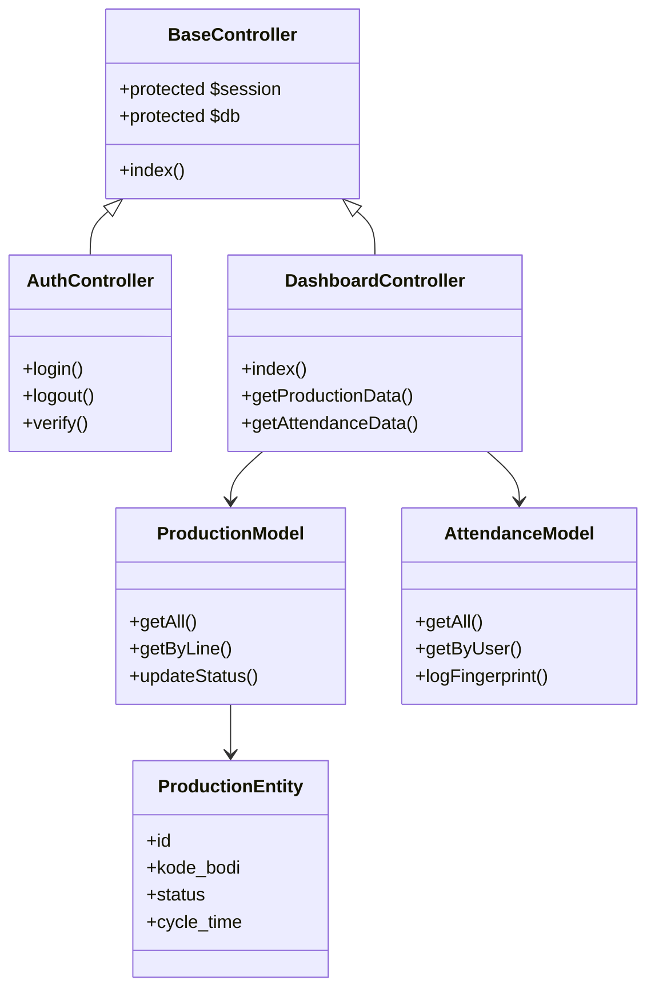
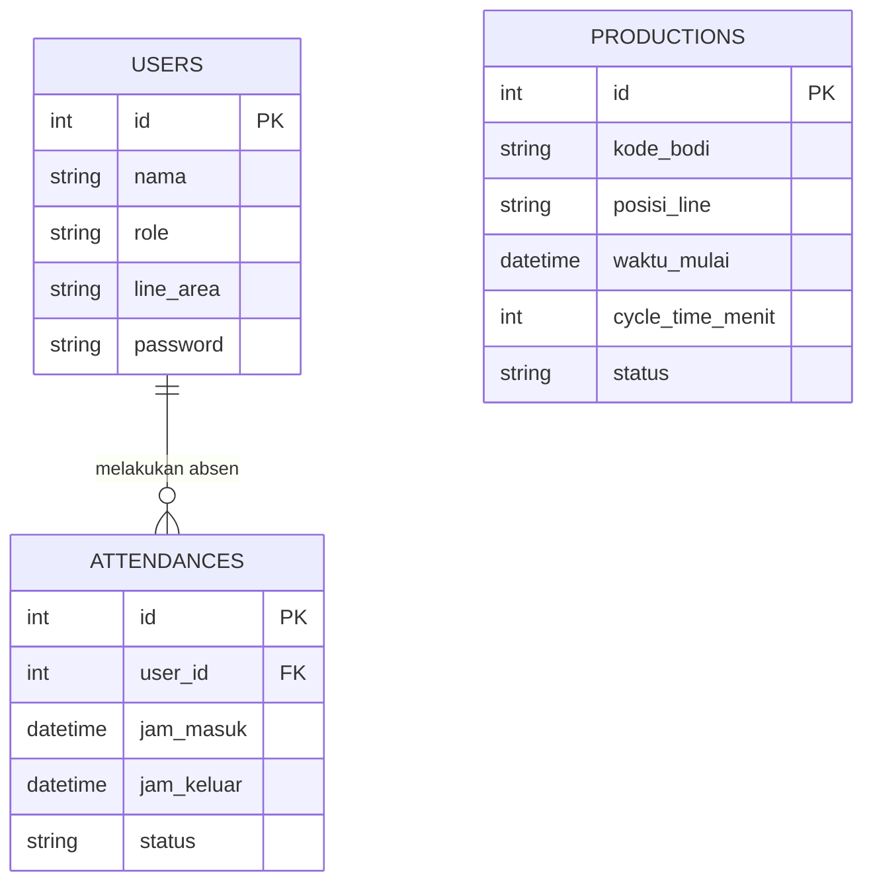

# PRD — Project Requirements Document

## 1. Overview
PT. Mekar Armada Jaya (pabrik karoseri mobil) membutuhkan sebuah **Dashboard Sistem Monitoring Alur Produksi** untuk mempermudah pengawasan operasional dan memantau kehadiran karyawan secara efisien. 

Saat ini, aplikasi difokuskan sebagai purwarupa (prototype) lanjutan yang menggunakan **data dummy** (baik untuk proses produksi maupun data absensi sidik jari/fingerprint). Tujuan utamanya adalah menampilkan visualisasi data secara **real-time** dalam bentuk tabel dan grafik (chart) agar Manajer Pabrik dan Supervisor Line dapat mengambil keputusan dengan cepat, khususnya dalam memantau *Cycle Time* (waktu siklus produksi) dan kesiapan tenaga kerja di lapangan.

Sistem ini dibangun menggunakan **CodeIgniter 4 (PHP)** untuk backend agar memudahkan deployment pada lingkungan server lokal yang sudah familiar dengan stack PHP, tetap terintegrasi dengan **GitHub** untuk	version control, dan menggunakan **Vue.js** untuk frontend yang interaktif.

## 2. Requirements
- **Sumber Data:** Aplikasi menggunakan sistem *generator* data dummy otomatis di latar belakang (via CLI Command atau Controller Background) untuk menyimulasikan data mesin produksi dan mesin *fingerprint*.
- **Frekuensi Pembaruan:** *Real-time* (Simulasi). Perubahan data muncul di layar tanpa perlu *refresh* halaman manual, menggunakan mekanisme **AJAX Polling** atau **Server-Sent Events (SSE)** yang kompatibel dengan lingkungan PHP lokal.
- **Akses Pengguna:** Memiliki sistem login dasar yang membedakan hak akses antara **Manajer Pabrik** (melihat laporan keseluruhan) dan **Supervisor Line** (fokus pada lini produksi masing-masing).
- **Infrastruktur:** Aplikasi akan dipasang (deploy) pada **Server Lokal (On-Premise)** pabrik (misalnya menggunakan XAMPP/Laragon/Windows Server dengan PHP). Source code terintegrasi dengan **Repository GitHub** untuk kemudahan manajemen versi dan backup, meskipun deployment bersifat lokal.
- **Batasan (Scope):** Integrasi dengan sistem lama (legacy) diabaikan untuk saat ini. Pemantauan *Finish Material* dibuat sangat simpel (hanya berupa status "Selesai" pada tabel).

## 3. Core Features
- **Dashboard Metrik Utama (Visual Chart):**
  - Grafik *Live Cycle Time* (Waktu Siklus) per lini produksi karoseri.
  - Grafik batang/lingkaran perbandingan rasio kehadiran karyawan terhadap target produksi hari itu.
- **Tabel Monitoring Produksi Real-time:**
  - Tabel dinamis yang menampilkan ID Unit Mobil, Tahapan Produksi saat ini, Waktu Mulai, Status (Berjalan, Tertunda, Selesai), dan Peringatan jika *Cycle Time* melebihi batas wajar. Termasuk pencatatan simpel untuk unit yang sudah menjadi *Finish Material*.
- **Tabel Monitoring Kehadiran (Integrasi Fingerprint Dummy):**
  - Rekap otomatis nama karyawan, jam masuk, jam keluar, dan lokasi pos kerjanya di lini produksi.
- **Manajemen Pengguna (Role-based Control):**
  - **Manajer Pabrik:** Bisa melihat rekap data seluruh lini produksi, tren *cycle time* mingguan/bulanan.
  - **Supervisor Line:** Melihat dan fokus pada tabel operasional harian yang terjadi di area pengawasannya saja.

## 4. User Flow
1. **Login:** Supervisor atau Manajer membuka aplikasi web melalui jaringan WiFi/LAN pabrik dan memasukkan akun.
2. **Identifikasi Peran:** Sistem (CodeIgniter 4) mengecek peran pengguna (Supervisor atau Manajer) via session dan mengarahkan ke halaman utama yang sesuai.
3. **Melihat Dashboard:** Pengguna disambut oleh grafik (chart) yang bergerak secara *real-time* (via polling) menampilkan metrik *Cycle Time* produksi karoseri.
4. **Inspeksi Operasional:** Pengguna mengklik tab "Tabel Produksi" untuk melihat detail unit mobil mana saja yang sedang dikerjakan atau mengalami keterlambatan.
5. **Pengecekan Kehadiran:** Pengguna mengklik tab "Kehadiran" untuk memastikan jumlah karyawan di lini produksi mencukupi berdasarkan data sidik jari (*fingerprint*).
6. **Logout:** Pengguna keluar dari aplikasi setelah jam kerja atau pengawasan selesai (session dihancurkan).

## 5. Architecture
Karena menggunakan backend PHP (CodeIgniter 4), mekanisme *real-time* akan diadaptasi menggunakan **AJAX Polling** (permintaan berkala dari frontend ke API endpoint) untuk memastikan kompatibilitas maksimal pada server lokal tanpa perlu menjalankan proses daemon WebSocket terpisah yang kompleks. Sumber code dikelola via **GitHub** namun di-deploy secara lokal.

### 5.1 System Flowchart


### 5.2 Use Case Diagram
```mermaid
usecaseDiagram
    actor "Manajer Pabrik" as Manager
    actor "Supervisor Line" as Supervisor
    usecase "Login ke Sistem" as UC1
    usecase "View Dashboard Utama" as UC2
    usecase "Monitor Tabel Produksi" as UC3
    usecase "Monitor Kehadiran Karyawan" as UC4
    usecase "Lihat Laporan Tren (Weekly/Monthly)" as UC5
    usecase "Logout" as UC6

    Manager --> UC1
    Manager --> UC2
    Manager --> UC3
    Manager --> UC4
    Manager --> UC5
    Manager --> UC6

    Supervisor --> UC1
    Supervisor --> UC2
    Supervisor --> UC3
    Supervisor --> UC4
    Supervisor --> UC6
    
    UC5 ..> Manager : Khusus Manajer
```

### 5.3 Use Case Scenarios
| ID | Use Case | Actor | Deskripsi Singkat | Precondition | Postcondition |
| :--- | :--- | :--- | :--- | :--- | :--- |
| UC1 | Login | Semua | Pengguna memasukkan kredensial untuk masuk sistem. | Belum login | Session aktif, redirect sesuai role. |
| UC2 | View Dashboard | Semua | Menampilkan grafik metrik utama secara real-time. | Sudah login | Data grafik ter-load. |
| UC3 | Monitor Produksi | Semua | Melihat tabel status unit mobil per lini. | Sudah login | Detail unit terlihat. |
| UC4 | Monitor Kehadiran | Semua | Melihat rekap absensi fingerprint dummy. | Sudah login | Data kehadiran terlihat. |
| UC5 | Lihat Laporan Tren | Manajer | Melihat grafik historis mingguan/bulanan. | Role = Manajer | Data tren terlihat. |
| UC6 | Logout | Semua | Mengakhiri sesi pengguna. | Sudah login | Session hancur, kembali ke login. |

### 5.4 Activity Diagram (Login & Monitoring)


### 5.5 Sequence Diagram (Monitoring Produksi)


### 5.6 Class Diagram (Backend Structure)


## 6. Database Schema
Berikut adalah tabel utama yang dibutuhkan. Sistem ini dirancang sederhana agar mudah dipahami, dengan tabel spesifik untuk memantau produksi dan kehadiran.

**Daftar Tabel Utama:**
1. **Users:** Menyimpan data pekerja (manajer & supervisor).
   - `id` (INT) - Primary Key
   - `nama` (VARCHAR) - Nama pekerja
   - `role` (ENUM) - 'Manajer', 'Supervisor', 'Operator'
   - `line_area` (VARCHAR) - Area kerja pabrik (misal: Line Welding, Line Painting)
   - `password` (VARCHAR) - Hash password login
2. **Attendances:** Mencatat data *fingerprint* dummy.
   - `id` (INT) - Primary Key
   - `user_id` (INT) - Foreign Key ke Users
   - `jam_masuk` (DATETIME) - Waktu *fingerprint* masuk
   - `jam_keluar` (DATETIME) - Waktu *fingerprint* keluar
   - `status` (VARCHAR) - Hadir, Terlambat, Absen
3. **Productions:** Mencatat status unit karoseri di lini produksi.
   - `id` (INT) - Primary Key
   - `kode_bodi` (VARCHAR) - Nomor identifikasi bodi mobil
   - `posisi_line` (VARCHAR) - Lokasi line produksi saat ini
   - `waktu_mulai` (DATETIME) - Waktu masuk line
   - `cycle_time_menit` (INT) - Durasi pengerjaan saat ini
   - `status` (ENUM) - 'Proses', 'Tertunda', 'Finish Material'



## 7. Tech Stack
Berdasarkan input yang diberikan dan kebutuhan fitur (*real-time* via polling & *local deployment*), berikut adalah rekomendasi teknologinya:

- **Frontend:** **Vue.js** (Disarankan menggunakan Tailwind CSS untuk mempercepat pembuatan desain, dan pustaka *ECharts* atau *Chart.js* untuk membuat grafik visual).
- **Backend:** **CodeIgniter 4 (PHP)** (Ringan, performa tinggi, mudah dikonfigurasi pada server lokal berbasis PHP, dan memiliki struktur MVC yang rapi).
- **Real-time Engine:** **AJAX Polling / Server-Sent Events (SSE)** (Diimplementasikan melalui jQuery/Axios di Vue.js yang memanggil API Endpoint CI4 setiap beberapa detik untuk mensimulasikan real-time tanpa kebutuhan daemon WebSocket kompleks).
- **Database:** **MySQL** (Cocok untuk penyimpanan data log terstruktur seperti absensi dan tahapan produksi di server perusahaan).
- **Deployment / Infrastruktur:** **Server Lokal (On-Premise)** menggunakan stack PHP standar (seperti XAMPP, Laragon, atau Apache+Nginx+PHP-FSM). Terintegrasi dengan **GitHub** untuk version control source code, meskipun server tidak terhubung langsung ke internet publik (sync dilakukan secara manual/berkala jika diperlukan).